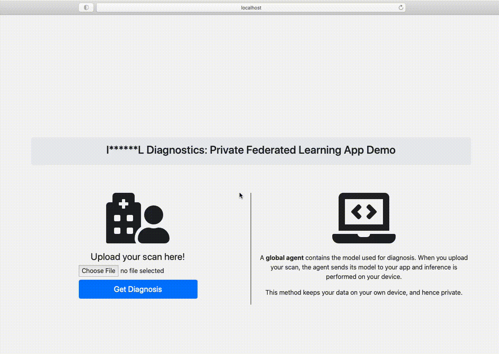

# Private Inference

This section contains the source code for a Proof-of-Concept demo app that patients can use to get their diagnosis, provided they possess a digital copy of their scan. Images from the diabetic retinopathy dataset can be uploaded to this app, and a diagnosis is returned within seconds, reducing the resources that hospitals would spend diagnosing patients who are not at risk of vision loss.

## Deployed App Demo

The demo app has been deployed on heroku on the followinng link: https://imperial-diagnostics.herokuapp.com.

## App Source Code

The folder `app/` contains code for a demo app that patients can use to get their diagnosis, provided they possess a digital copy of their scan.

The app can launched locally by downloading the folder and running `python app.py`. The app will accept any image from the diabetic retinopathy dataset as input (a few example inputs are provided in the folder) and will produce an output, as per the demo video below:

